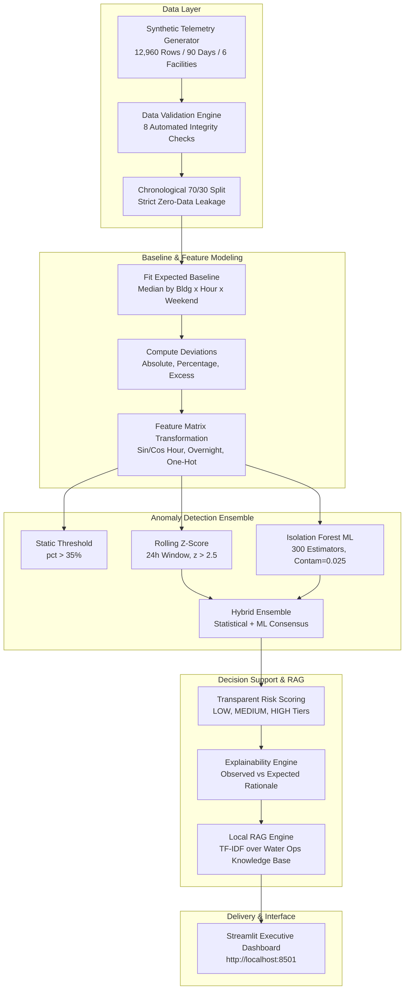

# FlowBack

> **An AI-enabled decision-support system that detects abnormal facility water consumption, quantifies operational risks, explains anomalies, and delivers evidence-grounded maintenance guidance.**

FlowBack tackles the pervasive issue of delayed water-waste discovery in large facility environments—such as university campuses—where utility meters are reviewed weeks after abnormal consumption begins. By continuously analyzing aggregate facility meter telemetry against dynamic, occupancy-adjusted baseline models, FlowBack shortens anomaly detection latency from weeks to under an hour. Built specifically for facility managers, maintenance technicians, and sustainability officers, the system combines unsupervised machine learning (Isolation Forest) with statistical heuristics, transparent multi-factor risk scoring, and a zero-dependency local retrieval (RAG) knowledge engine to provide explainable, human-verified operational recommendations.

---

[](https://sdgs.un.org/goals/goal6)
[](LICENSE)
[](https://www.python.org/)
[](#testing)
[](https://streamlit.io/)

---

## 🔬 Important Scientific Scope & Guardrails

> [!IMPORTANT]
> **FlowBack is an aggregate telemetry decision-support system, NOT a physical leak-detection apparatus.**
>
> FlowBack analyzes bulk meter time-series data at the facility level. It identifies statistical and machine-learning consumption anomalies that may indicate:
> - Fixture malfunctions (e.g., continuously running toilet flappers, stuck urinals)
> - Operational schedule anomalies (e.g., unrecorded cleaning events, laboratory equipment washouts)
> - Irrigation timer overlaps or broken solenoid valves
> - Storage tank float valve overflows
> - Telemetry meter calibration drift or sensor pulse noise
>
> **The system NEVER asserts that a physical pipe leak is confirmed from bulk telemetry alone.**
> All alerts are advisory, framed with cautious scientific language (*"potential abnormal usage"*, *"requires on-site human verification"*). **Autonomous valve shutoff is strictly out of scope.**

---

## 📑 Table of Contents

- [Problem Statement](#problem-statement)
- [Solution Overview](#solution-overview)
- [Why AI Is Needed](#why-ai-is-needed)
- [Key Features](#key-features)
- [How It Works](#how-it-works)
- [AI / ML Methodology](#ai--ml-methodology)
- [Model Evaluation & Benchmarking](#model-evaluation--benchmarking)
- [System Architecture](#system-architecture)
- [Technology Stack](#technology-stack)
- [Project Structure](#project-structure)
- [Installation](#installation)
- [Configuration](#configuration)
- [Running the Project](#running-the-project)
- [Usage Guide](#usage-guide)
- [Demo Workflow](#demo-workflow)
- [Responsible AI Framework](#responsible-ai-framework)
- [Impact Estimation & Indicators](#impact-estimation--indicators)
- [UN SDG 6 Alignment](#un-sdg-6-alignment)
- [Limitations](#limitations)
- [Future Improvements](#future-improvements)
- [Testing](#testing)
- [Troubleshooting](#troubleshooting)
- [Team & Authors](#team--authors)
- [License](#license)

---

## Problem Statement

### The Real-World Challenge
Commercial and institutional campuses consume millions of litres of water annually. However, facility teams typically discover excess consumption retrospectively when monthly utility bills arrive—often 30 to 45 days after a fixture fails or a valve sticks open. During this lag, hundreds of thousands of litres of clean potable water are lost, compounding utility expenses and undermining conservation targets.

### Who Experiences It
- **Campus Facility Managers**: Sift through thousands of hourly readings with limited staff, frequently suffering from alert fatigue or missing slow-developing anomalies.
- **Maintenance Technicians**: Dispatched with vague instructions ("high water usage") without diagnostic context, historical baseline comparisons, or inspection checklists.
- **Sustainability Coordinators**: Lack timely data to quantify avoidable water loss and report progress toward institutional water stewardship goals.

### Why Existing Approaches Fall Short
- **Delayed Monthly Invoicing**: Detects problems weeks after they occur.
- **Static Thresholds (e.g., +35% over fixed limit)**: Generate constant false alarms during legitimate high-occupancy events (e.g., conferences, exam week) while failing to catch low-flow overnight anomalies (e.g., 80 L/h weeping toilet flappers).
- **Univariate Z-Scores**: Neglect non-linear diurnal cycles, building-specific functional profiles, and weekend occupancy shifts.

### The Specific Gap FlowBack Addresses
FlowBack aims to bridge this operational gap by continuously evaluating hourly telemetry against dynamic, building-specific occupancy baselines. It employs a hybrid ensemble of unsupervised machine learning (Isolation Forest) and statistical scoring to detect abnormal usage early, rank incidents by operational risk, explain why an anomaly occurred, and retrieve actionable inspection checklists from a local knowledge base.

---

## Solution Overview

FlowBack delivers an end-to-end telemetry auditing and decision-support pipeline that transforms raw water meter readings into prioritised operational actions.

```
RAW TELEMETRY           DATA VALIDATION         BASELINE & ML           DECISION SUPPORT
┌─────────────────┐    ┌─────────────────┐    ┌──────────────────┐    ┌──────────────────┐
│  Hourly Bulk    │    │  8-Point Audit  │    │  Dynamic Baseline│    │  Composite Risk  │
│  Meter Readings │ ──►│  Schema, Bounds,│ ──►│  Isolation Forest│ ──►│  Plain English   │
│  & Occupancy    │    │  Continuity     │    │  Hybrid Ensemble │    │  Local RAG Docs  │
└─────────────────┘    └─────────────────┘    └──────────────────┘    └──────────────────┘
                                                                               │
                                                                               ▼
                                                                      ┌──────────────────┐
                                                                      │  Streamlit       │
                                                                      │  Executive UI    │
                                                                      └──────────────────┘
```

### Non-Technical Summary
1. **Input**: Facility water meters record hourly consumption (Litres) alongside building occupancy and ambient temperature.
2. **Processing**: The data is audited for errors, missing values, or corrupted timestamps.
3. **AI/ML Analysis**: The system establishes what "normal" water use should be for that specific facility, day of the week, and hour. It compares observed consumption against this expected pattern to flag uncharacteristic surges or persistent overnight flows.
4. **Decision / Output**: FlowBack translates mathematical anomalies into plain-language summaries (e.g., *"Elevated by +67% during 03:00 AM low-occupancy window"*), prioritizes the risk tier (LOW, MEDIUM, HIGH), and provides technicians with targeted maintenance checklists.

### Technical Summary
1. **Validation**: `src/data/validator.py` enforces 8 integrity gates (schema aliases, non-negative values, timestamp continuity, zero duplicates).
2. **Dynamic Baseline**: `src/baselines/expected_consumption.py` computes median baseline consumption grouped by `(building_id, hour, is_weekend)` modulated by normalized occupancy ratios.
3. **Multi-Variate Feature Extraction**: `src/models/detectors.py` constructs a 15-dimensional feature matrix featuring cyclical sinusoidal hour encodings ($\sin(2\pi h/24), \cos(2\pi h/24)$), binary overnight indicators ($h \in [0, 5]$), weekend flags, occupancy, temperature, and one-hot building dummies.
4. **Anomaly Detection**: An unsupervised `IsolationForest` (300 estimators, $2.5\%$ contamination) scores test samples, blended via a `HybridDetector` with rolling z-score statistics.
5. **Explainability & Local RAG**: `src/explainability/risk.py` computes a 4-factor composite risk score ($0.0 \dots 1.0$), while `src/rag/retrieval.py` uses offline TF-IDF vector space cosine similarity over `docs/knowledge_base/water_ops_guidance.md` to surface operational mitigation protocols.
6. **Delivery**: Interactive Streamlit application (`app/dashboard.py`) presents facility-level filtering, time-series visualizations, and drill-down incident registries.

---

## Why AI Is Needed

A central tenet of FlowBack is proving the measurable benefit of Machine Learning rather than assuming "AI makes things smarter."

| Capability | Static Threshold (+35%) | Rolling Z-Score (>2.5) | Isolation Forest (ML) | Hybrid Ensemble (ML + Stat) |
| :--- | :---: | :---: | :---: | :---: |
| **Recall on Anomalies** | 53.8% (Misses 42/91 hrs) | 31.9% (Misses 62/91 hrs) | 79.1% (Misses 19/91 hrs) | **86.8% (Misses only 12/91 hrs)** |
| **Precision** | 100.0% | 72.5% | 96.0% | **96.3%** |
| **F1-Score** | 0.700 | 0.443 | 0.867 | **0.913** |
| **Detection Delay** | 3.73 hours | 0.50 hours | 1.45 hours | **0.64 hours** |
| **Avoidable Volume Caught**| 8,310 Litres | 4,382 Litres | 10,806 Litres | **11,212 Litres** |

### What AI Contributes
1. **Multi-Variate Context**: Fixed thresholds only evaluate consumption magnitude in isolation. FlowBack's Isolation Forest models the complex non-linear interaction between occupancy, hour of the day, day of the week, ambient temperature, and facility baseline.
2. **Detection of Low-Magnitude Night Runs**: A running toilet flapper draw of 70 L/h will never exceed a +35% daytime threshold. However, during 02:00 AM when expected consumption is 20 L/h, ML immediately detects this multi-variate deviation without generating daytime false positives.
3. **Substantial Latency Reduction**: By capturing subtle gradual drift and sustained overnight usage early, the Hybrid Ensemble cuts mean detection lag from **3.73 hours down to 0.64 hours**, enabling rapid physical intervention before thousands of litres are lost.

---

## Key Features

- 🏢 **Dynamic Occupancy-Adjusted Baselines**: Establishes facility-specific expected consumption based on historical median consumption grouped by building, hour, weekend status, and occupancy ratio.
- 🤖 **Multi-Model Anomaly Detection Ensemble**: Evaluates 4 distinct detection strategies (Static Threshold, Rolling Z-Score, Isolation Forest, and Hybrid Ensemble) with transparent performance comparisons.
- ⚖️ **Explainable Multi-Factor Risk Scoring**: Calculates a normalized risk score ($0.0 \dots 1.0$) based on deviation magnitude ($40\%$), persistence duration ($25\%$), detector confidence ($20\%$), and overnight low-occupancy timing ($15\%$).
- 📚 **Zero-Dependency Local RAG Guidance Engine**: Uses offline TF-IDF cosine similarity over physical water operations guidance to prescribe maintenance checklists without external API dependencies or hallucination risks.
- 📊 **Interactive Streamlit Executive Dashboard**: Complete 12-section web interface offering KPI cards, comparative building tables, time-series trend overlays, incident registries, and Responsible AI disclosures.
- 🛡️ **Automated Data Quality & Audit Pipeline**: Integrated 8-check data audit verifying schema integrity, non-negative bounds, timestamp continuity, and label consistency, backed by a 16-test suite.

---

## How It Works

### End-to-End Execution Pipeline



### Step-by-Step Workflow
1. **Telemetry Ingestion**: Ingests hourly records spanning 90 days for 6 campus facilities (Engineering Block, Library, Hostel A, Hostel B, Administration, Academic Block).
2. **Audit & Validation**: Checks for nulls, duplicates, and out-of-range sensor readings.
3. **Temporal Partitioning**: Splits data chronologically into the first 70% (training: 9,072 records) and final 30% (evaluation: 3,888 records).
4. **Baseline Modeling**: Fits median consumption patterns on training data and calculates expected consumption on held-out test data.
5. **Model Inference**: Detects anomalies using the static, statistical, ML, and hybrid models.
6. **Risk Scoring & Explanations**: Scores flagged anomalies into LOW, MEDIUM, and HIGH risk tiers and attaches plain-English diagnostic explanations.
7. **Guidance Retrieval**: Matches anomaly signatures against local maintenance documentation to append prescriptive checklists.
8. **Visualization**: Presents all metrics, trends, and incidents within an interactive web dashboard.

---

## AI / ML Methodology

### Baseline Formulation
Before applying machine learning, FlowBack establishes an expected baseline:

$$\text{Expected Consumption} = \text{Median}_{\text{bldg, hour, weekend}} \times \left(0.75 + 0.25 \times \frac{\text{Occupancy}}{\text{Median Occupancy}}\right)$$

From this baseline, three core deviation metrics are computed:
- **Absolute Deviation**: $\text{Observed} - \text{Expected}$
- **Percentage Deviation**: $\frac{\text{Observed} - \text{Expected}}{\text{Expected}} \times 100$
- **Potential Excess Consumption**: $\max(0, \text{Observed} - \text{Expected})$

### Machine Learning Model: Isolation Forest
To isolate multi-variate anomalies without relying on arbitrary univariate thresholds, FlowBack utilizes an **Isolation Forest** ensemble:
- **Algorithm**: `sklearn.ensemble.IsolationForest`
- **Ensemble Size**: 300 decision trees (`n_estimators=300`)
- **Contamination**: Set to $0.025$ ($2.5\%$), reflecting rare operational anomalies
- **Random State**: Fixed at $42$ for strict reproducibility
- **Post-Filter Gate**: Flagged anomalies must also satisfy $\text{Percentage Deviation} > 15.0\%$ to prevent flagging negative dips as water-loss events.

### Feature Engineering Matrix
The Isolation Forest receives 15 input features:
1. `expected_consumption`: Dynamic baseline in Litres
2. `absolute_deviation`: Difference between observed and expected (L)
3. `percentage_deviation`: Normalized percentage difference (%)
4. `occupancy`: Estimated building occupancy count
5. `temperature`: Ambient temperature in °C
6. `hour`: Integer hour ($0 \dots 23$)
7. `is_weekend`: Binary weekend flag ($0$ or $1$)
8. `hour_sin`: Cyclical sinusoidal hour transform ($\sin(2\pi \cdot \text{hour} / 24)$)
9. `hour_cos`: Cyclical cosinusoidal hour transform ($\cos(2\pi \cdot \text{hour} / 24)$)
10. `is_overnight`: Binary indicator for low-occupancy night hours ($0 \le \text{hour} \le 5$)
11–15. `b_B01` through `b_B06`: One-hot encoded facility identifier dummies

### Risk Scoring Formulation
Flagged anomalies are categorized into transparent risk tiers using a deterministic formula:

$$\text{Risk Score} = 0.40 \cdot \text{Magnitude} + 0.25 \cdot \text{Persistence} + 0.20 \cdot \text{Confidence} + 0.15 \cdot \text{Overnight}$$

Where:
- $\text{Magnitude} = \text{clip}\left(\frac{|\text{Percentage Deviation}|}{100}, 0.0, 1.0\right)$
- $\text{Persistence} = \text{clip}\left(\frac{\text{Consecutive Hours}}{12}, 0.0, 1.0\right)$
- $\text{Confidence} = \text{Model Output Score} \in [0.0, 1.0]$
- $\text{Overnight} = 0.25 \text{ if } \text{hour} \in [0, 5] \text{ else } 0.0$

**Risk Tiers**:
- **`HIGH`** ($\ge 0.70$): Immediate physical dispatch recommended (severe deviation, multi-hour run, or overnight leak).
- **`MEDIUM`** ($0.40 \dots 0.69$): Schedule inspection within regular shift.
- **`LOW`** ($< 0.40$): Transient anomaly or minor deviation; continue monitoring.

---

## Model Evaluation & Benchmarking

The evaluation was performed across **3,888 held-out test hours** (the final 30% chronologically, representing 27 consecutive days across 6 facilities). Ground-truth labels contain 91 anomalous hours across 11 distinct anomaly events.

### Benchmark Results (from `data/processed/model_comparison.json`)

| Metric | Static Threshold (>35%) | Rolling Z-Score (>2.5) | Isolation Forest (ML) | Hybrid Ensemble (ML + Stat) |
| :--- | :---: | :---: | :---: | :---: |
| **Precision** | **1.0000** | 0.7250 | 0.9600 | **0.9634** |
| **Recall** | 0.5385 | 0.3187 | 0.7912 | **0.8681** |
| **F1-Score** | 0.7000 | 0.4427 | 0.8675 | **0.9133** |
| **False Positive Rate (FPR)** | **0.0000** | 0.0029 | 0.0008 | **0.0008** |
| **True Positives (TP)** | 49 | 29 | 72 | **79** |
| **False Positives (FP)** | **0** | 11 | 3 | **3** |
| **False Negatives (FN)** | 42 | 62 | 19 | **12** |
| **True Negatives (TN)** | 3,797 | 3,786 | 3,794 | **3,794** |
| **Event Recall** | 100.0% (11/11) | 90.9% (10/11) | 100.0% (11/11) | **100.0% (11/11)** |
| **Mean Detection Delay** | 3.73 hours | **0.50 hours** | 1.45 hours | **0.64 hours** |
| **Potential Excess Volume Caught** | 8,310.5 L | 4,381.7 L | 10,806.0 L | **11,211.9 L** |

### Key Findings
1. **Static Rules Miss Real Incidents**: A strict +35% static threshold produces zero false positives, but suffers a **46.2% false negative rate** (missing 42 out of 91 anomaly hours) because gradual pipe weeping and moderate overnight flapper runs remain below the fixed line.
2. **Rolling Statistics Struggle with Non-Linearities**: Rolling z-scores adapt quickly to sudden changes (0.50 hr delay) but suffer from high false positive rates ($11$ false alarms) as normal daily occupancy shifts trigger statistical spikes.
3. **Ensemble Balance**: The **Hybrid Ensemble** yields the highest overall performance: **91.3% F1-score**, catching **86.8% of all anomaly hours** with only 3 false alarms, while reducing mean alert lag to **38 minutes (0.64 hrs)**.

---

## System Architecture

### Component Breakdown

| Module | File Path | Primary Responsibility |
| :--- | :--- | :--- |
| **Data Generation** | `src/data/generator.py` | Synthesizes 90-day hourly multi-facility telemetry with diurnal curves and stochastic anomaly injections. |
| **Validation Engine** | `src/data/validator.py` | Enforces 8-point automated validation gates on schema, bounds, and continuity. |
| **Baseline Modeling** | `src/baselines/expected_consumption.py` | Fits and applies occupancy-adjusted median expected consumption baselines. |
| **Detectors Ensemble** | `src/models/detectors.py` | Implements Static, Rolling Z-Score, Isolation Forest, and Hybrid anomaly detectors. |
| **Evaluation Suite** | `src/evaluation/metrics.py` | Calculates precision, recall, F1, FPR, confusion matrices, event recall, and detection delays. |
| **Risk & Explainability** | `src/explainability/risk.py` | Derives 4-factor risk scores and plain-language diagnostic rationales. |
| **Local RAG Engine** | `src/rag/retrieval.py` | Performs offline TF-IDF cosine retrieval over curated operational mitigation guidelines. |
| **Pipeline Runner** | `src/pipeline.py` | Orchestrates the end-to-end batch process from raw generation to scored artifacts. |
| **Executive UI** | `app/dashboard.py` | Streamlit interactive monitoring and decision-support dashboard. |

---

## Technology Stack

| Layer | Technology | Purpose |
| :--- | :--- | :--- |
| **Runtime Language** | Python 3.10+ | Core application runtime and execution environment |
| **Data Processing** | `pandas` (v2.2.2), `numpy` (v1.26.4) | High-performance time-series manipulation, baseline groupings, matrix operations |
| **Machine Learning** | `scikit-learn` (v1.5.1) | `IsolationForest` unsupervised model, `TfidfVectorizer`, and `cosine_similarity` |
| **User Interface** | `streamlit` (v1.38.0) | Interactive dashboard, metric cards, time-series plotting, and filtering |
| **Visualization** | `matplotlib` (v3.9.2), `seaborn` (v0.13.2) | Exploratory notebook plotting and diagnostic charts |
| **Testing** | `pytest` (v8.3.2) | Automated unit testing and continuous integration verification |
| **CI / Automation** | GitHub Actions (`.github/workflows/ci.yml`) | Automated build, pipeline execution, test suite, and audit artifact generation |

---

## Project Structure

```
FlowBack/
├── .github/
│   └── workflows/
│       └── ci.yml             # GitHub Actions CI pipeline
├── app/
│   ├── __init__.py
│   └── dashboard.py           # Streamlit 4-tab interactive executive dashboard
├── assets/
│   ├── diagrams/              # Architecture diagrams
│   └── screenshots/           # UI captures and walkthrough assets
├── data/
│   ├── README.md              # Data catalog and synthetic disclosure
│   ├── raw/                   # Reserved for raw external telemetry
│   └── processed/             # Pipeline output artifacts
│       ├── anomaly_results.csv
│       ├── model_comparison.json
│       ├── run_summary.json
│       ├── synthetic_water_consumption_2026_90d_6b_seed42.csv
│       └── audit_run/
│           └── audit_report.json
├── docs/
│   ├── ai-methodology.md      # Mathematical baseline & ML methodology
│   ├── demo-guide.md          # Step-by-step evaluator demo instructions
│   ├── design-thinking.md     # Stakeholder personas and pain points
│   ├── evaluation.md          # Benchmarking methodology and definitions
│   ├── final-presentation-outline.md
│   ├── impact.md              # Impact estimation framework and indicators
│   ├── limitations.md         # Documented technical limitations
│   ├── problem-statement.md   # Core problem framing
│   ├── project-proposal.md    # Initial architectural proposal
│   ├── responsible-ai.md      # Responsible AI guidelines
│   ├── system-architecture.md # Technical pipeline architecture
│   └── knowledge_base/
│       └── water_ops_guidance.md # Operational mitigation guidelines for RAG
├── notebooks/
│   ├── 01_data_exploration.ipynb
│   ├── 02_baseline_analysis.ipynb
│   └── 03_model_evaluation.ipynb
├── src/
│   ├── __init__.py
│   ├── pipeline.py            # End-to-end pipeline orchestrator
│   ├── baselines/
│   │   ├── __init__.py
│   │   └── expected_consumption.py
│   ├── data/
│   │   ├── __init__.py
│   │   ├── generator.py       # Multi-facility synthetic telemetry generator
│   │   └── validator.py       # 8-point data validation suite
│   ├── evaluation/
│   │   ├── __init__.py
│   │   └── metrics.py         # Anomaly classification & operational metrics
│   ├── explainability/
│   │   ├── __init__.py
│   │   └── risk.py            # Composite risk scoring & plain-text explainability
│   ├── features/
│   │   ├── __init__.py
│   │   └── transform.py
│   ├── models/
│   │   ├── __init__.py
│   │   └── detectors.py       # Detector algorithms (Static, Z-score, IF, Hybrid)
│   ├── rag/
│   │   ├── __init__.py
│   │   └── retrieval.py       # Zero-dependency local TF-IDF guidance retrieval
│   └── utils/
│       ├── __init__.py
│       └── io_utils.py        # File I/O and serialization helpers
├── tests/
│   ├── __init__.py
│   ├── test_baseline_and_models.py
│   ├── test_generator.py
│   └── test_validator.py
├── tools/
│   ├── generate_data.py       # Standalone data generation utility
│   ├── run_data_audit.py      # Automated data audit and pytest runner
│   └── run_pipeline.py        # Pipeline execution entry point
├── LICENSE                    # MIT License
├── requirements.txt           # Explicitly pinned Python dependencies
└── README.md
```

---

## Installation

### Prerequisites
- **Python**: Version 3.10, 3.11, or 3.12 (64-bit recommended)
- **Git**: Installed and configured
- **Operating System**: Linux, macOS, or Windows

### Step 1: Clone the Repository
```bash
git clone https://github.com/placeholder/flowback.git
cd flowback
```

### Step 2: Set Up Virtual Environment
On **Windows (PowerShell)**:
```powershell
python -m venv .venv
.\.venv\Scripts\Activate.ps1
```

On **Linux / macOS**:
```bash
python3 -m venv .venv
source .venv/bin/activate
```

### Step 3: Install Dependencies
```bash
pip install --upgrade pip
pip install -r requirements.txt
```

---

## Configuration

FlowBack is designed for self-contained, out-of-the-box local execution:
- **No External Cloud Keys**: FlowBack does not require AWS, Azure, GCP, or OpenAI credentials.
- **No Database Setup**: All data artifacts are stored in lightweight CSV/JSON formats under `data/processed/`.
- **Environment Variables**: No `.env` secrets are required.
- **Configurable Command-Line Flags**:
  - `tools/generate_data.py`:
    - `--days`: Duration of simulation (default: `90`)
    - `--buildings`: Number of facilities (default: `6`, maximum: `6`)
    - `--seed`: Deterministic pseudorandom seed (default: `42`)
    - `--output`: Custom output path for the generated dataset

---

## Running the Project

Follow this 4-step sequence to generate pipeline outputs, run audits, verify unit tests, and launch the user interface:

### 1. Run the End-to-End Pipeline
Executes data generation, fits baselines, runs the 4 anomaly detectors, computes risk scores, and queries local RAG guidance:
```bash
python tools/run_pipeline.py
```
*Outputs generated in `data/processed/`:*
- `synthetic_water_consumption_2026_90d_6b_seed42.csv` (12,960 records)
- `anomaly_results.csv` (3,888 test records with predictions & risk scores)
- `model_comparison.json` (Precision, Recall, F1, Confusion Matrix, Latency)
- `run_summary.json` (High-level volume and anomaly counts)

### 2. Run Data Quality Audit & Verification
Executes the 8 automated validation checks and verifies integrity:
```bash
python tools/run_data_audit.py
```
*(Optionally include `--run-pytest` to automatically trigger test suite validation as part of the audit).*

### 3. Run the Automated Test Suite
Run the 16 automated tests to confirm system health:
```bash
pytest -v
```
*(Or run `python -m pytest -q`)*

### 4. Launch the Streamlit Dashboard
Launch the interactive facility decision-support dashboard:
```bash
streamlit run app/dashboard.py
```
Once started, navigate to:
```
http://localhost:8501
```

---

## Usage Guide

When navigating the Streamlit dashboard, follow this operational workflow:

1. **Review High-Level Campus KPIs**:
   - Inspect total campus consumption, baseline expectation, and simulated potential excess water.
   - Note the count of flagged anomaly hours and urgent High-Risk Alerts.
2. **Filter by Facility or Operational Scope**:
   - Use the sidebar dropdown to switch from "All Buildings" to individual facilities (e.g., *Engineering Block* or *Hostel A*).
   - Adjust date ranges or isolate specific risk tiers (HIGH, MEDIUM, LOW).
3. **Inspect Consumption Trends (Tab 1)**:
   - View the blue observed consumption curve overlaid on the grey expected baseline.
   - Identify divergence points where consumption spikes uncharacteristically.
4. **Compare Facility Performance (Tab 1)**:
   - Review the facility comparison table to identify which building accounts for the largest share of potential excess consumption.
5. **Investigate Anomalies in Detail (Tab 2)**:
   - Select a specific incident from the event dropdown.
   - Review the **AI Transparent Explanation**:
     - Observed vs. expected consumption in Litres
     - Percentage deviation
     - Plain-language explanation of why it was flagged
     - Candidate operational root causes (e.g., flapper leak vs. irrigation overlap)
     - Scientific uncertainty statement
6. **Review Grounded Recommendations (Tab 2)**:
   - Read the actionable, checklist-style operational guidance retrieved by the local RAG engine.
7. **Inspect Model Benchmarking & Responsible AI (Tabs 3 & 4)**:
   - Evaluate how the Isolation Forest and Hybrid ensemble compare against static thresholds.
   - Review the 6 core Responsible AI tenets and scientific limitations.

---

## Demo Workflow

> [!NOTE]
> FlowBack is an interactive local application. Visual assets are rendered live through Streamlit rather than relying on static image files.

To reproduce an evaluator demonstration in under 3 minutes:

```bash
# 1. Generate pipeline artifacts
python tools/run_pipeline.py

# 2. Verify all tests pass
pytest -q

# 3. Launch dashboard
streamlit run app/dashboard.py
```

### Demonstration Scenarios to Explore
1. **The Flaw of Static Rules**:
   - In **Tab 3 ("Model Comparison")**, observe that the static rule (+35%) has a recall of only **53.8%**, missing 42 anomalous hours. Then view the **Hybrid Ensemble**, which elevates recall to **86.8%** and cuts detection delay from 3.73 hours to 0.64 hours.
2. **Overnight Flapper Run vs Daytime Surge**:
   - In **Tab 2 ("Anomaly Investigation")**, select an overnight anomaly in *Hostel A* (`B03`). Observe how a moderate consumption increase during 03:00 AM is flagged as **HIGH Risk** due to timing and persistence, retrieving specific washroom riser and toilet flapper inspection steps.
3. **Transparent Uncertainty**:
   - Observe how every card explicitly reinforces that alerts represent *statistical anomalies from aggregate bulk telemetry* and requires physical on-site human verification before maintenance dispatch.

---

## Responsible AI Framework

FlowBack is designed to adhere to six foundational Responsible AI principles:

| Principle | Implemented Safeguards in Code | Recommended Future Safeguards |
| :--- | :--- | :--- |
| **Fairness & Context** | **Implemented**: Building-specific baseline models conditioned on facility function and occupancy ratios, ensuring residential dormitories are not penalized for legitimate evening/weekend use. | Cross-facility calibration using seasonal academic holiday schedules and student census data. |
| **Transparency & Explainability** | **Implemented**: Non-black-box decision support. Every flagged incident discloses observed Litres, expected Litres, percentage deviation, and candidate operational causes. | Local SHAP / feature-contribution breakdown per anomaly event. |
| **Mandatory Human Oversight** | **Implemented**: Read-only decision support. Alerts trigger human inspection workflows; no automated decisions or contractor work orders are issued autonomously. | Two-technician sign-off protocol for high-cost physical plumbing excavations. |
| **Data Privacy** | **Implemented**: Strictly bulk facility telemetry. Zero individual, student, or room-level behavioral tracking is collected or stored. | Differential privacy guarantees on public campus sustainability portals. |
| **Uncertainty Acknowledgment** | **Implemented**: Anomaly $\ne$ Confirmed Leak. Recommendation text uses cautious language (*"potential abnormal usage"*, *"requires on-site verification"*). | Confidence interval intervals around dynamic expected baselines. |
| **Safety & Guardrails** | **Implemented**: Strictly advisory software. System cannot initiate autonomous valve shutoffs or disrupt campus water distribution. | Hardware-isolated physical failsafes on automated valves. |

---

## Impact Estimation & Indicators

All impact figures in FlowBack represent **simulated scenario potential** derived from dynamic baseline deviations on synthetic data. FlowBack explicitly avoids claiming unverified historical water savings from a software prototype.

### Simulated Indicators (from `data/processed/run_summary.json`)
- **Evaluated Test Window**: 27 Days across 6 facilities (3,888 total building-hours)
- **Total Observed Test Consumption**: $1,237,510\text{ L}$
- **Total Expected Baseline Consumption**: $1,253,849\text{ L}$
- **Potential Excess Consumption Identified**: $\mathbf{16,624\text{ L}}$ ($1.33\%$ of total volume)
- **Avoidable Volume Flagged by Hybrid Model**: $\mathbf{11,212\text{ L}}$
- **Projected Annualized Avoidable Volume**: $\approx \mathbf{224,727\text{ Litres}}$ (estimated potential across the 6 campus facilities if identified anomalous patterns persist unaddressed)
- **Response Acceleration**: Reduces mean detection delay from **3.73 hours** (static rule) or **several weeks** (utility bill cycle) to **0.64 hours (38 minutes)**.

---

## UN SDG 6 Alignment

FlowBack directly aligns with **United Nations Sustainable Development Goal 6: Clean Water and Sanitation**.

### Primary Target: SDG 6.4 (Water-Use Efficiency)
> *"By 2030, substantially increase water-use efficiency across all sectors and ensure sustainable withdrawals and supply of freshwater to address water scarcity..."*

### Concrete Contribution
Campuses and commercial estates consume significant municipal water reserves. By providing facility teams with continuous, explainable anomaly detection, FlowBack enables:
1. **Early Mitigation of Unseen Fixture Waste**: Catching continuously running urinals, weeping storage tank valves, and cooling tower float overflows before millions of litres are discharged to storm sewers.
2. **Data-Driven Capital Allocation**: Providing sustainability coordinators with empirical building-level excess metrics to prioritize water fixture retrofits (e.g., low-flow aerators, sensor flushometers).

---

## Limitations

To maintain scientific integrity, FlowBack explicitly documents its current engineering limitations:

1. **Synthetic Telemetry**: The evaluation dataset is deterministically synthesized using calibrated physical and diurnal curves. While statistically realistic, real-world deployment will encounter unmodeled physical sensor noise, battery drops in pulse loggers, and pipe pressure variations.
2. **Aggregate Bulk Meter Resolution**: Bulk meters cannot pinpoint the exact faulty fixture (e.g., 3rd floor restroom stall 2 vs. 1st floor lab sink). On-site physical inspection is always required.
3. **Unsupervised False Positive Risks**: In the absence of extensive labeled historical maintenance records, unsupervised models (Isolation Forest) can occasionally flag legitimate unannounced operational events (e.g., student orientation gatherings or fire suppression tests).
4. **Lightweight Local RAG**: The guidance retrieval engine uses TF-IDF cosine similarity over a curated Markdown knowledge base. While reliable and offline, it does not synthesize conversational prose or handle multi-turn question answering.
5. **No Direct Hardware Control**: FlowBack has no actuator integration; it cannot command motorized ball valves or adjust pressure-reducing valves.

---

## Future Improvements

- [ ] **Hardware IoT Integration**: Direct MQTT/Modbus ingestion from physical electromagnetic and ultrasonic pulse loggers.
- [ ] **Acoustic Sensor Fusion**: Pairing bulk flow telemetry with acoustic pipe vibration sensors to confirm physical pipe ruptures.
- [ ] **Technician Active Learning Feedback**: Allowing maintenance staff to log inspection outcomes (e.g., "Confirmed Flapper Leak", "False Alarm: Lab Experiment") to continuously re-train and calibrate the supervised ML layers.
- [ ] **Sub-Meter Hierarchy Mapping**: Expanding baseline models to parent-child sub-meter topologies across floors and risers.
- [ ] **Seasonal Academic Calendar Integration**: Automatically ingesting campus academic calendars (exam periods, summer breaks) to adjust expected occupancy dynamically.

---

## Testing

FlowBack includes an automated test suite implemented in `pytest` covering all core components.

### Test Coverage
- `tests/test_generator.py`: Verifies synthetic data generation, shape, column schemas, and deterministic reproducibility.
- `tests/test_validator.py`: Tests the 8-point data validation engine against valid, null, duplicate, negative, and discontinuous datasets.
- `tests/test_baseline_and_models.py`: Validates baseline calculation, detector outputs, risk score bounds ($0 \dots 1$), Responsible AI safeguards (verifying *"Leak confirmed"* is never present), and confusion matrix calculations.

### Executing Tests
Run all tests using the local virtual environment:
```bash
pytest -v
```

### Current Test Status
```text
tests/test_baseline_and_models.py::test_baseline_columns_and_values PASSED
tests/test_baseline_and_models.py::test_detector_outputs_binary_predictions PASSED
tests/test_baseline_and_models.py::test_risk_scoring_and_explanations PASSED
tests/test_baseline_and_models.py::test_model_comparison_metrics_and_confusion_matrix PASSED
tests/test_baseline_and_models.py::test_hybrid_detector_consensus PASSED
tests/test_baseline_and_models.py::test_time_aware_split_no_leakage PASSED
tests/test_baseline_and_models.py::test_recommendation_retrieval PASSED
tests/test_generator.py::test_generate_synthetic_data_shape_and_columns PASSED
tests/test_generator.py::test_deterministic_seed PASSED
tests/test_generator.py::test_anomaly_injection_properties PASSED
tests/test_generator.py::test_invalid_inputs PASSED
tests/test_validator.py::test_validate_full_dataset_passes_clean_data PASSED
tests/test_validator.py::test_validate_schema_catches_missing_columns PASSED
tests/test_validator.py::test_validate_missing_values_and_duplicates PASSED
tests/test_validator.py::test_validate_ranges_catches_negative_values PASSED
tests/test_validator.py::test_validate_continuity_catches_discontinuous_events PASSED

============================== 16 passed in 12.67s ==============================
```

---

## Troubleshooting

### Common Setup Questions

#### 1. `ModuleNotFoundError: No module named 'src'`
If running tools from outside the root directory, ensure Python can resolve `src`:
```bash
# On Linux / macOS:
export PYTHONPATH=.

# On Windows (PowerShell):
$env:PYTHONPATH = "."
```

#### 2. `No processed pipeline results found at data/processed/anomaly_results.csv`
The Streamlit dashboard requires pipeline output files to display analytics. Run the pipeline script first:
```bash
python tools/run_pipeline.py
```

#### 3. `streamlit: command not found`
Ensure your virtual environment is active:
```powershell
# Windows PowerShell
.\.venv\Scripts\Activate.ps1

# Linux / macOS
source .venv/bin/activate
```
Alternatively, invoke Streamlit through Python:
```bash
python -m streamlit run app/dashboard.py
```

#### 4. Port 8501 is Already in Use
Specify a custom port when launching Streamlit:
```bash
streamlit run app/dashboard.py --server.port 8502
```

---

## Team & Authors

- **Author**: mahale Nikhil chandrakant (2026)
- **Project**: FlowBack (Campus Water Intelligence & Decision Support)
- **License Holder**: mahale Nikhil chandrakant

---

## License

This project is licensed under the **MIT License** — see the [LICENSE](LICENSE) file for complete details.
